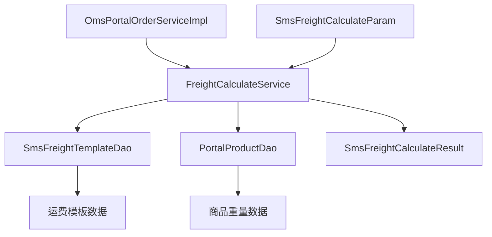
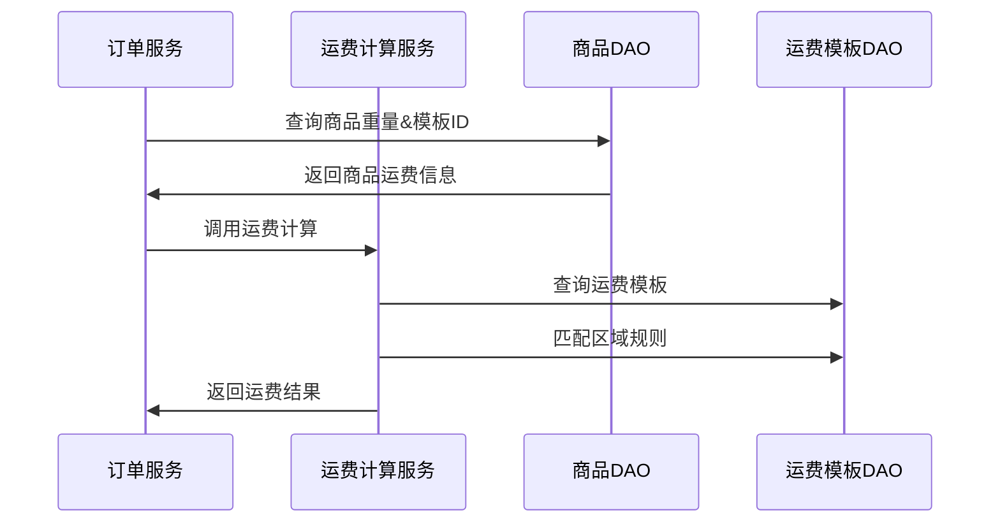

# 广横走商城运费计算逻辑文档

## 📋 概述

本文档详细描述了广横走商城的运费计算逻辑实现，包括业务规则、技术架构和具体实现细节。

---

## 🎯 业务规则

### 1. 运费计算优先级

```
1. 检查包邮条件 → 2. 区域规则匹配 → 3. 运费精确计算
```

#### 1.1 包邮条件检查
系统首先检查是否满足包邮条件，支持以下包邮类型：

| 包邮类型 | 代码值 | 说明 | 示例 |
|---------|--------|------|------|
| 不包邮 | 0 | 不享受包邮优惠 | - |
| 满金额包邮 | 1 | 订单总金额达到指定额度 | 满99元包邮 |
| 满件数包邮 | 2 | 商品件数达到指定数量 | 满3件包邮 |
| 满重量包邮 | 3 | 商品总重量达到指定重量 | 满5kg包邮 |
| 无条件包邮 | 4 | 直接免运费 | 全场包邮 |

#### 1.2 区域规则匹配
如果不满足包邮条件，系统根据收货地址匹配运费规则：

1. **优先匹配**：查找配送区域包含收货省份的特定规则
2. **兜底匹配**：使用"全国"通用规则
3. **异常处理**：无匹配规则时使用系统默认模板

#### 1.3 运费精确计算
根据运费模板的计费方式进行精确计算：

| 计费方式 | 代码值 | 计算公式 | 说明 |
|---------|--------|----------|------|
| 按件数 | 1 | 首件费用 + (总件数-首件数) ÷ 续件数 × 续件费用 | 向上取整 |
| 按重量 | 2 | 首重费用 + (总重量-首重) ÷ 续重 × 续重费用 | 向上取整 |
| 按体积 | 3 | 首体积费用 + (总体积-首体积) ÷ 续体积 × 续体积费用 | 向上取整 |
| 固定运费 | 4 | 固定金额 | 不论数量、重量 |

---

## 🏗️ 技术架构

### 2.1 核心组件



### 2.2 数据流程



---

## 💻 实现细节

### 3.1 核心类说明

#### FreightCalculateServiceImpl
- **职责**：运费计算核心逻辑
- **主要方法**：
  - `calculateFreight()` - 运费计算入口
  - `checkFreeShipping()` - 包邮条件检查
  - `calculateRegionFreight()` - 区域运费计算

#### SmsFreightTemplateDao
- **职责**：运费模板数据访问
- **主要方法**：
  - `getMatchingRegion()` - 获取匹配的区域规则
  - `getDefaultRegion()` - 获取默认区域规则

#### PortalProductDao.ProductFreightInfo
- **职责**：商品运费信息DTO
- **主要字段**：
  - `weight` - 商品重量（克）
  - `freightTemplateId` - 运费模板ID

### 3.2 数据模型

#### 运费计算参数 (SmsFreightCalculateParam)
```java
public class SmsFreightCalculateParam {
    private List<FreightCalculateItemParam> items;     // 商品列表
    private String receiverProvince;                   // 收货省份
    private String receiverCity;                       // 收货城市
    private String receiverRegion;                     // 收货区域
    
    public static class FreightCalculateItemParam {
        private Long productId;                        // 商品ID
        private Long skuId;                           // SKU ID
        private Integer quantity;                      // 商品数量
        private BigDecimal weight;                     // 商品重量(kg)
        private BigDecimal volume;                     // 商品体积(m³)
        private BigDecimal price;                      // 商品价格
        private Long freightTemplateId;               // 运费模板ID
    }
}
```

#### 运费计算结果 (SmsFreightCalculateResult)
```java
public class SmsFreightCalculateResult {
    private BigDecimal totalFreight;                   // 总运费
    private Boolean isFreeShipping;                    // 是否包邮
    private String freeShippingReason;                 // 包邮原因
    private List<FreightCalculateDetail> details;     // 运费详情
    
    public static class FreightCalculateDetail {
        private Long templateId;                       // 模板ID
        private String templateName;                   // 模板名称
        private List<Long> productIds;                // 商品ID列表
        private BigDecimal templateFreight;           // 模板运费
        private Boolean isFree;                       // 是否免费
        private String freeReason;                    // 免费原因
        private String calculation;                   // 计算说明
    }
}
```

---

## 🔧 配置说明

### 4.1 运费模板配置

#### 包邮设置
- **包邮类型** (`free_type`)：0-不包邮，1-满金额，2-满件数，3-满重量，4-无条件包邮
- **包邮金额** (`free_amount`)：满金额包邮的金额门槛
- **包邮件数** (`free_count`)：满件数包邮的件数门槛
- **包邮重量** (`free_weight`)：满重量包邮的重量门槛（kg）

#### 基础信息
- **计费类型** (`charge_type`)：1-按件数，2-按重量，3-按体积，4-固定运费
- **配送方式** (`delivery_type`)：1-快递配送，2-门店自取
- **状态** (`status`)：0-禁用，1-启用

#### 运费规则配置
- **配送区域** (`region_names`)：支持配送的省份名称，多个省份用逗号分隔
- **首件/首重/首体积** (`first_count`)：首次计费的基准量
- **首件/首重/首体积费用** (`first_amount`)：首次计费的费用
- **续件/续重/续体积** (`additional_count`)：追加计费的单位量
- **续件/续重/续体积费用** (`additional_amount`)：追加计费的单位费用

### 4.2 商品配置

#### 商品基础信息
- **商品重量** (`weight`)：商品重量，单位克，默认1000克
- **运费模板ID** (`freight_template_id`)：关联的运费模板，为空时使用默认模板

---

## 📝 使用示例

### 5.1 按件数计费示例

**运费模板配置：**
- 计费方式：按件数 (charge_type = 1)
- 首件：1件，费用10元
- 续件：每1件，费用5元

**订单商品：**
- 商品数量：3件

**计算过程：**
```
运费 = 首件费用 + (总件数 - 首件数) ÷ 续件数 × 续件费用
     = 10 + (3 - 1) ÷ 1 × 5
     = 10 + 2 × 5
     = 20元
```

### 5.2 按重量计费示例

**运费模板配置：**
- 计费方式：按重量 (charge_type = 2)
- 首重：1kg，费用12元
- 续重：每0.5kg，费用6元

**订单商品：**
- 商品A：2件 × 0.8kg = 1.6kg
- 商品B：1件 × 0.3kg = 0.3kg
- 总重量：1.9kg

**计算过程：**
```
运费 = 首重费用 + ⌈(总重量 - 首重) ÷ 续重⌉ × 续重费用
     = 12 + ⌈(1.9 - 1) ÷ 0.5⌉ × 6
     = 12 + ⌈0.9 ÷ 0.5⌉ × 6
     = 12 + 2 × 6
     = 24元
```

### 5.3 满金额包邮示例

**运费模板配置：**
- 包邮类型：满金额包邮 (free_type = 1)
- 包邮金额：99元

**订单情况：**
- 商品总金额：120元
- 满足包邮条件：120 ≥ 99

**计算结果：**
```
运费 = 0元（满99元包邮）
```

---

## 🐛 常见问题

### Q1: 商品重量为空怎么处理？
**A:** 系统默认使用1000克（1kg）作为默认重量。

### Q2: 找不到匹配的区域规则怎么办？
**A:** 系统会使用"全国"通用规则，如果连全国规则都没有，则使用系统默认模板。

### Q3: 运费计算失败会怎样？
**A:** 系统会返回默认运费10元，确保订单流程不被中断。

### Q4: 支持哪些包邮条件？
**A:** 支持满金额、满件数、满重量、无条件包邮四种类型。

### Q5: 体积如何计算？
**A:** 目前使用重量估算：1kg ≈ 0.001m³，后续可以扩展为从商品属性获取。

---

## 🔄 版本历史

### v2.0 (2024-01-15)
- ✅ 新增XML映射文件支持
- ✅ 实现商品重量数据库获取
- ✅ 新增运费模板关联功能
- ✅ 支持无条件包邮
- ✅ 新增按体积计费
- ✅ 完善区域匹配逻辑

### v1.0 (2024-01-01)
- ✅ 基础运费计算功能
- ✅ 支持按件数、按重量计费
- ✅ 支持满金额、满件数、满重量包邮
- ✅ 默认运费模板机制

---

## 📞 技术支持

如有技术问题，请联系开发团队或查看相关源码：
- `FreightCalculateServiceImpl.java` - 运费计算核心逻辑
- `SmsFreightTemplateDao.xml` - 运费模板数据访问
- `PortalProductDao.xml` - 商品信息查询 