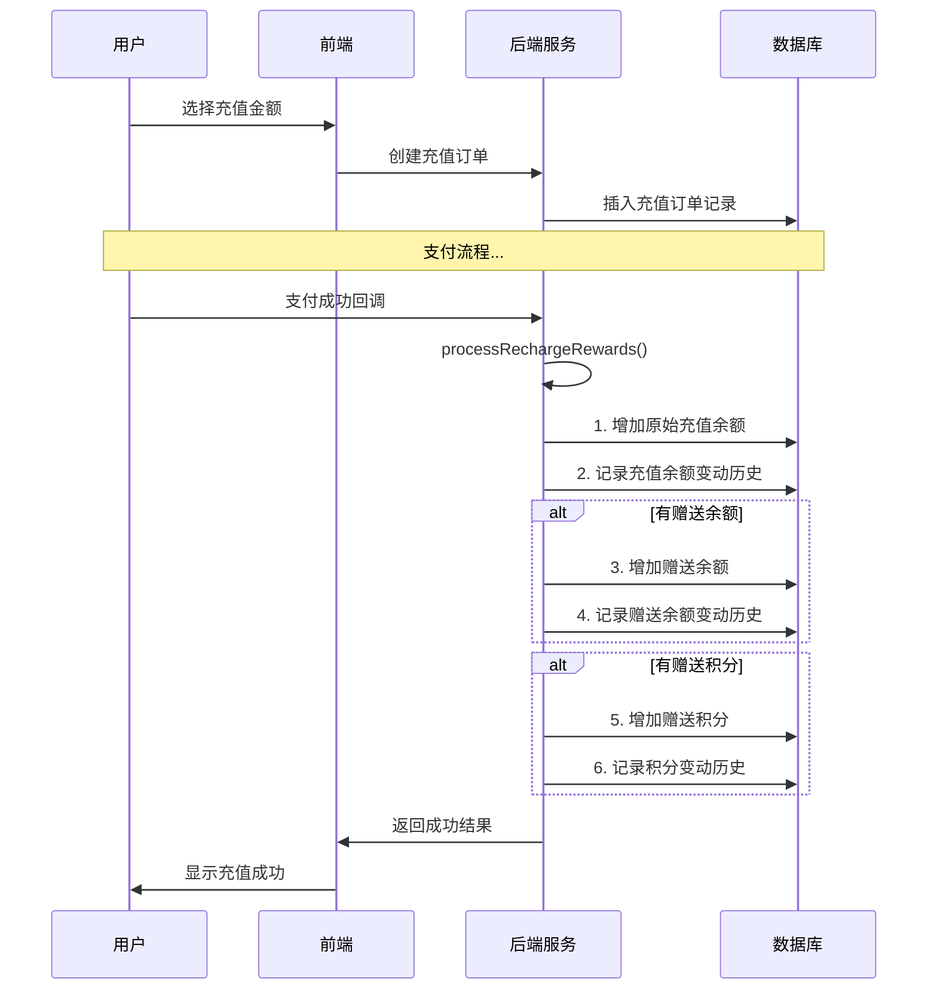

# 充值奖励功能实现说明

## 功能概述

充值奖励功能允许用户在充值时获得额外的余额和积分奖励。系统会根据充值金额自动匹配配置的奖励方案，并在充值成功后分别记录原始充值金额、赠送余额和赠送积分的变动历史。

## 实现架构

### 数据表结构

1. **ums_balance_config** - 充值配置表
   - `config_key`: `recharge.quick_amounts`
   - `config_value`: JSON格式的奖励配置

2. **ums_member_balance_history** - 余额变动历史表
   - 记录所有余额变动，包括原始充值和赠送余额
   - `business_type`: `recharge` (原始充值) / `recharge_bonus` (赠送余额)

3. **ums_integration_change_history** - 积分变动历史表
   - 记录积分变动历史
   - `source_type`: `2` (充值赠送)

### 核心实现流程



## 关键代码实现

### 1. 充值奖励处理主方法

```java
private boolean processRechargeRewards(Long memberId, BigDecimal rechargeAmount, String orderSn) {
    // 1. 增加原始充值金额
    addBalance(memberId, rechargeAmount, "recharge", orderSn, "充值" + rechargeAmount + "元");
    
    // 2. 查找奖励配置
    QuickAmountOption bonusOption = findBonusOption(rechargeAmount);
    
    if (bonusOption != null) {
        // 3. 处理赠送余额
        if (bonusOption.getBonusBalance() > 0) {
            addBalance(memberId, bonusOption.getBonusBalance(), "recharge_bonus", orderSn, 
                "充值赠送余额" + bonusOption.getBonusBalance() + "元");
        }
        
        // 4. 处理赠送积分
        if (bonusOption.getBonusIntegration() > 0) {
            addIntegration(memberId, bonusOption.getBonusIntegration(), orderSn, 
                "充值赠送积分" + bonusOption.getBonusIntegration() + "分");
        }
    }
    
    return true;
}
```

### 2. 积分变动记录方法

```java
private boolean addIntegration(Long memberId, Integer integration, String businessId, String remark) {
    // 更新用户积分
    UmsMember member = memberMapper.selectByPrimaryKey(memberId);
    Integer newIntegration = (member.getIntegration() != null ? member.getIntegration() : 0) + integration;
    member.setIntegration(newIntegration);
    memberMapper.updateByPrimaryKeySelective(member);
    
    // 记录积分变动历史
    UmsIntegrationChangeHistory history = new UmsIntegrationChangeHistory();
    history.setMemberId(memberId);
    history.setChangeType(0); // 0-增加积分
    history.setChangeCount(integration);
    history.setOperateMan("system");
    history.setOperateNote(remark);
    history.setSourceType(2); // 2-充值赠送
    history.setCreateTime(new Date());
    
    integrationChangeHistoryMapper.insertSelective(history);
    return true;
}
```

## 配置示例

### 充值配置JSON格式

```json
[
  {
    "amount": 50,
    "bonusBalance": 10.00,
    "bonusIntegration": 100,
    "description": "充值50元赠送10元余额+100积分"
  },
  {
    "amount": 100,
    "bonusBalance": 0.00,
    "bonusIntegration": 0,
    "description": "充值100元无赠送"
  }
]
```

## 业务类型说明

### 余额变动记录 (business_type)
- `recharge`: 原始充值金额
- `recharge_bonus`: 充值赠送的余额
- `order`: 订单消费
- `refund`: 退款

### 积分变动记录 (source_type)
- `0`: 购物获得
- `1`: 管理员修改
- `2`: 充值赠送

## 测试验证

1. 使用测试脚本：`test-recharge-rewards.bat YOUR_TOKEN`
2. 查看数据库变动记录：
   - `ums_member_balance_history` 表应有两条记录（充值+赠送）
   - `ums_integration_change_history` 表应有一条积分赠送记录
   - `ums_member` 表中用户余额和积分已更新

## 注意事项

1. **事务一致性**: 所有操作在同一事务中完成，确保数据一致性
2. **错误处理**: 任何步骤失败都会回滚整个事务
3. **日志记录**: 详细记录操作日志，便于问题排查
4. **配置验证**: 充值金额必须与配置中的快速金额选项完全匹配才能获得奖励
5. **历史记录**: 分别记录不同类型的变动，便于财务统计和用户查询

## 扩展功能

未来可以扩展的功能：
1. 基于用户等级的差异化奖励
2. 限时奖励活动
3. 累计充值奖励
4. 邀请好友充值奖励 