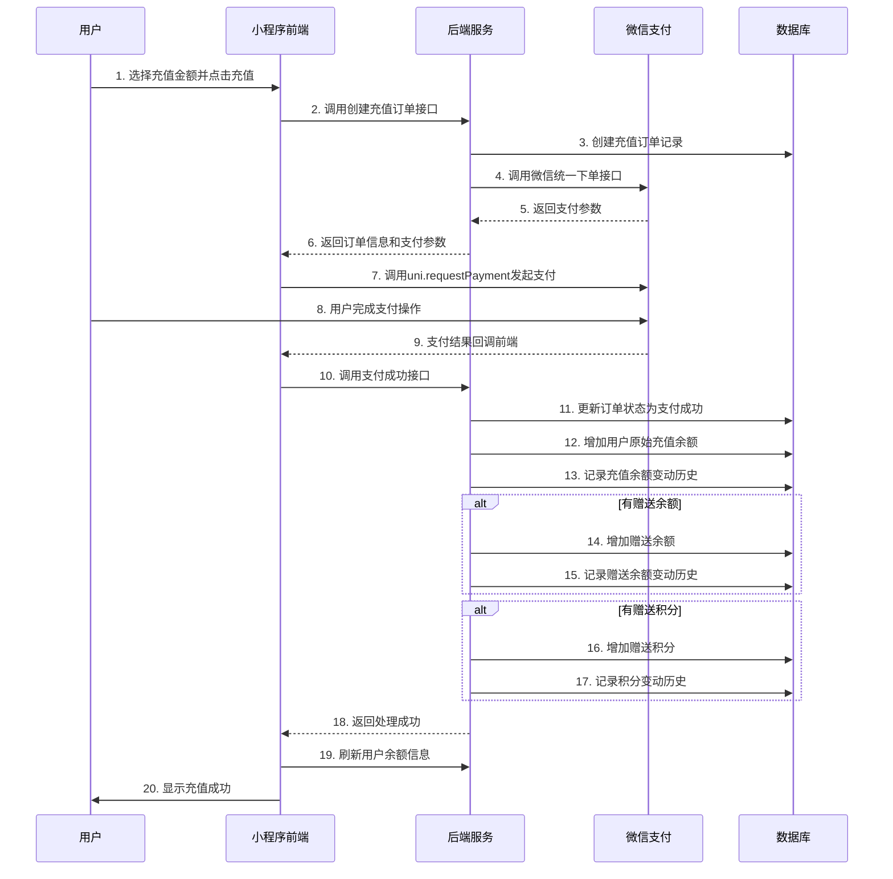

# 微信小程序充值支付流程

## 流程概述

用户在小程序中选择充值金额后，系统会创建充值订单，调用微信支付，支付成功后处理充值奖励。

## 完整流程图



## 技术实现详情

### 1. 前端实现 (mall-app-web/pages/money/money.vue)

#### 主要方法：

**confirmRecharge()** - 确认充值
- 验证充值金额
- 调用创建订单接口
- 获取微信支付参数
- 发起微信支付

**wxPay()** - 发起微信支付
- 使用uni.requestPayment调用微信支付
- 处理支付成功/失败回调

**handlePaySuccess()** - 处理支付成功
- 调用后端支付成功接口
- 刷新用户余额
- 显示充值成功消息

#### 关键代码片段：

```javascript
// 1. 创建充值订单
createRechargeOrder({
  amount: amount,
  payType: 2, // 微信支付
  note: `账户充值${amount}元`
}).then(res => {
  if (res.code === 200) {
    const orderData = res.data;
    const payParams = orderData.payParams;
    
    // 2. 发起微信支付
    this.wxPay(orderData, payParams);
  }
});

// 3. 微信支付
uni.requestPayment({
  provider: 'wxpay',
  timeStamp: payParams.timeStamp,
  nonceStr: payParams.nonceStr,
  package: payParams.packageValue,
  signType: payParams.signType || 'MD5',
  paySign: payParams.paySign,
  success: (res) => {
    // 4. 支付成功后调用后端接口
    this.handlePaySuccess(orderData);
  }
});

// 5. 处理支付成功
rechargePaySuccess({
  orderSn: orderData.orderSn,
  payType: 2,
  paySn: 'WX_' + Date.now()
}).then(res => {
  if (res.code === 200) {
    // 刷新余额并显示成功
    this.getUserInfo();
    uni.showToast({ title: '充值成功', icon: 'success' });
  }
});
```

### 2. 后端实现 (UmsMemberBalanceServiceImpl.java)

#### 主要方法：

**createRechargeOrder()** - 创建充值订单
- 验证用户和金额
- 生成订单号
- 创建订单记录
- 生成微信支付参数

**generateWxPayParams()** - 生成微信支付参数
- 调用微信统一下单接口
- 返回小程序支付所需参数

**handleRechargePaySuccess()** - 处理支付成功
- 更新订单状态
- 调用充值奖励处理逻辑

**processRechargeRewards()** - 处理充值奖励
- 增加原始充值余额
- 查找奖励配置
- 增加赠送余额（如有）
- 增加赠送积分（如有）
- 分别记录各种变动历史

#### 关键代码片段：

```java
// 1. 创建订单并生成支付参数
@Override
public RechargeOrderResult createRechargeOrder(Long memberId, RechargeOrderParam param) {
    // 创建订单记录
    UmsMemberRechargeOrder rechargeOrder = new UmsMemberRechargeOrder();
    // ... 设置订单信息
    
    // 生成微信支付参数
    WxPayMpOrderResult payParams = generateWxPayParams(rechargeOrder);
    orderResult.setPayParams(payParams);
    
    return orderResult;
}

// 2. 处理支付成功
@Override
public boolean handleRechargePaySuccess(String orderSn, Integer payType, String paySn) {
    // 更新订单状态
    order.setStatus((byte) 1); // 支付成功
    
    // 处理充值奖励
    boolean result = processRechargeRewards(order.getMemberId(), order.getAmount(), orderSn);
    
    return result;
}

// 3. 处理充值奖励
private boolean processRechargeRewards(Long memberId, BigDecimal rechargeAmount, String orderSn) {
    // 增加原始充值余额
    addBalance(memberId, rechargeAmount, "recharge", orderSn, "充值" + rechargeAmount + "元");
    
    // 查找奖励配置
    QuickAmountOption bonusOption = findBonusOption(rechargeAmount);
    
    if (bonusOption != null) {
        // 增加赠送余额
        if (bonusOption.getBonusBalance() > 0) {
            addBalance(memberId, bonusOption.getBonusBalance(), "recharge_bonus", orderSn, "充值赠送余额");
        }
        
        // 增加赠送积分
        if (bonusOption.getBonusIntegration() > 0) {
            addIntegration(memberId, bonusOption.getBonusIntegration(), orderSn, "充值赠送积分");
        }
    }
    
    return true;
}
```

## 数据库记录

### 订单记录 (ums_member_recharge_order)
- `order_sn`: 订单号
- `member_id`: 用户ID
- `amount`: 充值金额
- `status`: 订单状态 (0-待支付, 1-支付成功)
- `pay_type`: 支付方式 (2-微信支付)
- `pay_time`: 支付时间
- `pay_sn`: 支付流水号

### 余额变动记录 (ums_member_balance_history)
1. **原始充值记录**:
   - `business_type`: "recharge"
   - `amount`: 充值金额
   - `remark`: "充值50元"

2. **赠送余额记录**:
   - `business_type`: "recharge_bonus"
   - `amount`: 赠送金额
   - `remark`: "充值赠送余额10元"

### 积分变动记录 (ums_integration_change_history)
- `change_type`: 0 (增加积分)
- `change_count`: 赠送积分数量
- `source_type`: 2 (充值赠送)
- `operate_note`: "充值赠送积分100分"

## 错误处理

### 前端错误处理
1. **订单创建失败**: 显示具体错误信息
2. **支付参数获取失败**: 提示"获取支付参数失败"
3. **用户取消支付**: 显示"支付已取消"
4. **支付失败**: 显示"支付失败，请重试"
5. **支付成功但处理失败**: 显示"充值处理失败，请联系客服"

### 后端错误处理
1. **事务回滚**: 任何步骤失败都会回滚整个事务
2. **重复处理**: 检查订单状态，避免重复处理
3. **详细日志**: 记录每个步骤的执行情况和错误信息

## 测试验证

### 开发环境测试
1. 配置微信支付参数（测试环境）
2. 使用测试金额进行充值
3. 检查数据库记录是否正确

### 生产环境部署
1. 配置正式的微信支付参数
2. 设置正确的支付回调地址
3. 配置SSL证书确保支付安全

## 注意事项

1. **支付安全**: 
   - 支付参数需要在服务端生成
   - 订单验证必须在服务端完成
   - 不能仅依赖前端回调确认支付

2. **幂等性**: 
   - 支付成功接口需要支持重复调用
   - 避免重复增加余额和积分

3. **异步回调**: 
   - 微信支付会发送异步回调到服务端
   - 需要处理微信的异步通知接口

4. **用户体验**: 
   - 提供清晰的加载状态提示
   - 支付失败后给出明确的操作指引
   - 充值成功后及时更新页面数据 